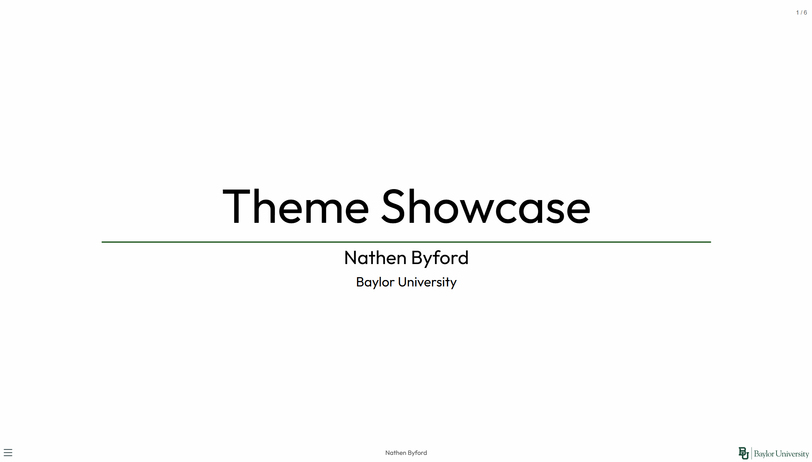
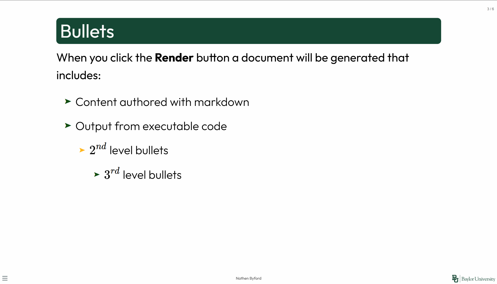
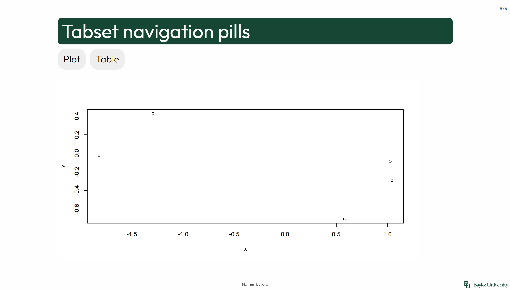

# Baylor reveal.js Theme for Quarto

This theme takes inspiration from the [metropolis](https://github.com/pat-s/xaringan-metropolis) and [quarto-metropolis](https://codeberg.org/pat-s/quarto-metropolis) themes. With some color changes, the Baylor University logo in the corner, and other athsteatic updates.

## Edits made

-   Baylor green headings,
-   Baylor logo,
-   Baylor green and gold arrow bullet points,
-   Outfit font default, and
-   Jetbrains mono font (No ligatures) for code blocks.
-   Image zoom (Radovan Miletić, [here](https://stackoverflow.com/questions/75922380/how-to-zoom-on-graph-in-slide-revealjs-quarto))

## Photos







## Usage notes

-   To use the template in for a new document use the following code in the terminal.

```         
quarto use template nathenbyford/baylor_theme
```

-   To use the template on a preexisting quarto document and just add the theme you can use the following code in the terminal within the working directory,

```         
quarto add nathenbyford/baylor_theme
```
Then after running the line of code in your terminal youll need to change your header to include
```
---
title: "Title"
author: Author
footer: Author
format: 
    baylor_theme-revealjs
---
```
More formatting arguments can still be included after this ti customize the document/presentation to your likeing and needs.